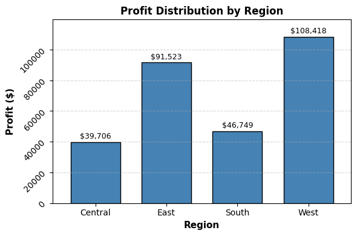

# FUTURE_DS_01

📊 Superstore Sales & Profitability Analysis
📌 Project Overview

This project performs an end-to-end Exploratory Data Analysis (EDA) on a retail Superstore dataset to uncover:

Revenue drivers

Profitability patterns

Customer concentration risk

Regional performance gaps

Discount impact on losses

The goal is to move beyond simple reporting and deliver business-focused insights that support pricing and strategic decisions.

🎯 Business Objectives

Identify which categories and sub-categories drive revenue and profit

Detect loss-making products and regions

Analyze customer purchase behavior

Measure revenue and profit concentration

Evaluate the impact of discounting on profitability

Detect risky pricing thresholds

🛠️ Tools & Technologies

Python

Pandas

Matplotlib

Plotly (Choropleth visualization)

Jupyter Notebook

📂 Dataset

Retail transactional dataset containing:

Order ID

Customer Name

Segment

Region

State

Category / Sub-Category

Sales

Profit

Discount

📈 Analysis Performed
1️⃣ Sales & Profit Overview

Total Sales

Total Profit

Overall Profit Margin

2️⃣ Category-Level Performance

Sales by Category

Profit by Category

Profit Margin by Category

📌 Key Finding:
Furniture generates high revenue but weak margins.

3️⃣ Sub-Category Analysis

Total Sales by Sub-Category

Total Profit by Sub-Category

Identification of loss-driving sub-categories

📌 Key Finding:
Tables and Bookcases contribute significantly to losses.

4️⃣ Customer Analysis
Top 10 Customers by Sales
Top 10 Customers by Profit
Revenue Concentration %
Profit Concentration %

📌 Insight:
Profit is more concentrated than revenue, indicating dependency risk.

5️⃣ Average Order Value (AOV)

AOV by Customer Segment

📌 Insight:
Corporate customers show stronger order value efficiency.

6️⃣ Regional Performance

Total Sales by Region

Total Profit by Region

Loss Rate by Region

📌 Insight:
Central region shows higher loss exposure.

7️⃣ State-Level Profitability

Interactive choropleth map (Plotly) showing:

Geographic profit concentration

Underperforming states

8️⃣ Discount Impact Analysis

Discount Distribution

Median Profit by Discount Level

Loss Rate by Discount Level

📌 Critical Finding:
Discounts above 30% dramatically increase probability of loss.

This suggests a pricing threshold that should be strategically controlled.

🚨 Key Insights

Revenue does not guarantee profitability.

Furniture category shows structural margin weakness.

Profit is highly concentrated among top customers.

Central region carries elevated loss risk.

High discounting is the primary driver of negative margins.

💡 Strategic Recommendations
Pricing Strategy

Limit discounts above 25–30%

Implement approval workflow for high-discount orders

Product Strategy

Re-evaluate pricing of loss-heavy sub-categories

Conduct cost structure review for Furniture

Regional Strategy

Audit Central region discounting behavior

Replicate West region pricing controls

Customer Strategy

Protect and retain top profitable customers

Develop loyalty programs for high-margin segments

📊 Sample Visualizations

(Insert screenshots in the images folder and reference them like below)

